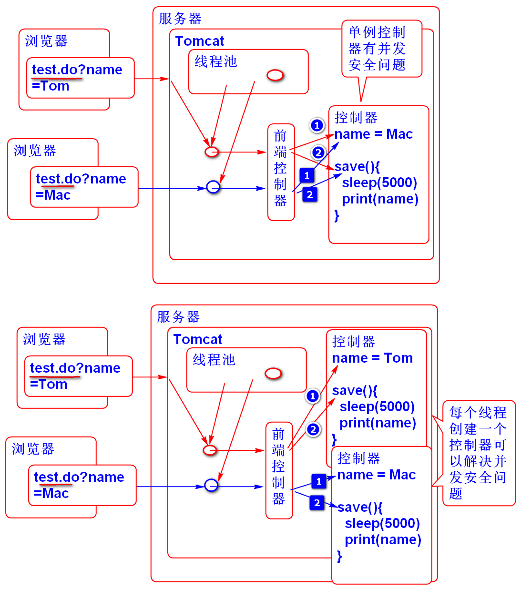
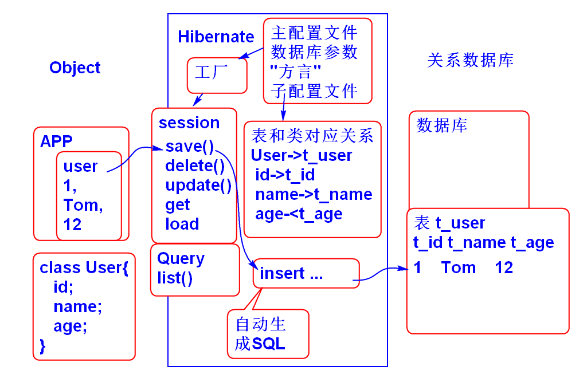
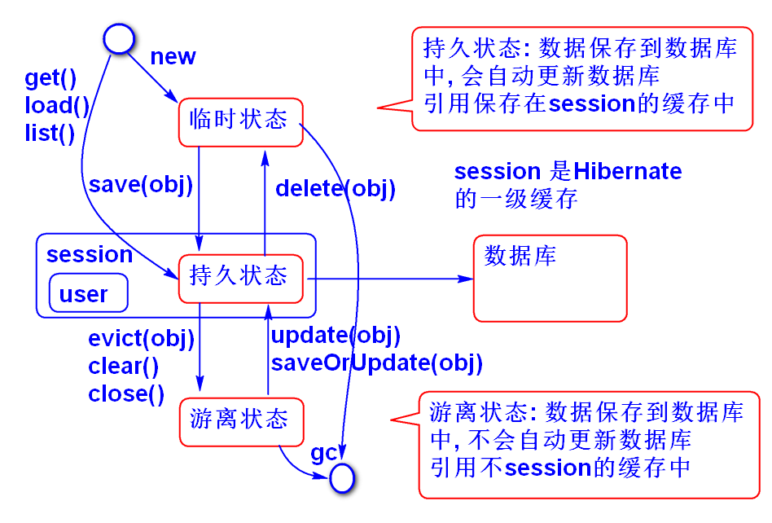

# SSH

## Struts2

### Struts2 控制器线程安全问题

和所有Web应用一样, Struts2 也工作在多线程并发模式. Struts2 的控制器也有线程并发问题. 当Spring将Struts2 的控制器作为单例对象管理时将有线程并发错误发生:

一个有并发错误的案例:

1. 编写控制器:
		
		@Controller
		public class TestAction {
			private String name;
			
			public String getName() {
				return name;
			}
			public void setName(String name) {
				this.name = name;
				Thread t = Thread.currentThread();
				System.out.println(t+" set "+name);
			}
			public String save() throws Exception{
				Thread.sleep(5000);
				Thread t = Thread.currentThread();
				System.out.println(t+" save "+name);
				return "success";
			}
		}

2. 配置组件扫描: spring-struts2.xml

		<context:component-scan base-package="ssh.day03"/>

3. 配置控制器: struts.xml

		<!-- 测试 线程并发安全问题 -->
		<action name="test" class="testAction"
			method="save">
			<result name="success">
				/WEB-INF/jsp/ok.jsp
			</result>
		</action>	

4. 测试: 使用两个浏览器并发访问服务器时候出现并发错误结果:

> 无状态Bean: 一个Java对象中除了只读的实例变量以为, 没有其他变量时候, 这个Java Bean就是无状态的Bean, 无状态的Bean在多线程并发访问时候是线程安全的. 常见的业务层Bean就是典型的无状态Bean

解决办法: 

1. Struts2中的控制器无法做到无状态;
2. 所有Struts2默认情况下为每个请求(线程)都创建了一个控制器实例, 这样就避免的多用户线程访问同一份对象属性的安全问题, 解决了线程安全问题. 
3. 利用Spring作为控制器工厂管理控制器时候, 应该利用@Scope("prototype")为每次请求创建新的控制器对象来解决线程安全问题.

案例: 如上案例只需要更新控制器, 添加@Scope("prototype")就可以解决线程安全问题. 

代码如下:

	@Controller
	@Scope("prototype")
	public class TestAction {
		private String name;
		
		public String getName() {
			return name;
		}
		public void setName(String name) {
			this.name = name;
			Thread t = Thread.currentThread();
			System.out.println(t+" set "+name);
		}
		public String save() throws Exception{
			Thread.sleep(5000);
			Thread t = Thread.currentThread();
			System.out.println(t+" save "+name);
			return "success";
		}
	}

## Hibernate 

Hibernate: 冬眠

数据持久化ORM框架, 对象关系映射: 按照面向对象的方式操作关系型数据库,不用写任何的SQL语句了!

使用步骤:

1. 导入Hibernate包 数据库驱动 和 JUnit:

		<dependency>
			<groupId>org.hibernate</groupId>
			<artifactId>hibernate-core</artifactId>
			<version>4.2.21.Final</version>
		</dependency>

		<!-- 添加mysql驱动 (不要选5.1.6) -->
		<dependency>
			<groupId>mysql</groupId>
			<artifactId>mysql-connector-java</artifactId>
			<version>5.1.40</version>
		</dependency>

		<!-- 添加junit用于实现单元测试 -->
		<dependency>
			<groupId>junit</groupId>
			<artifactId>junit</artifactId>
			<version>4.12</version>
		</dependency>

2. 配置主配置文件 hibernate.cfg.xml

		<?xml version="1.0" encoding="UTF-8"?>
		<!DOCTYPE hibernate-configuration PUBLIC
			"-//Hibernate/Hibernate Configuration DTD 3.0//EN"
			"http://www.hibernate.org/dtd/hibernate-configuration-3.0.dtd">
		<hibernate-configuration>
			<session-factory>
				<!-- Database connection settings -->
				<property name="connection.driver_class">
					com.mysql.jdbc.Driver
				</property>
				<property name="connection.url">
					jdbc:mysql://localhost:3306/ssh
				</property>
				<property name="connection.username">
					root
				</property>
				<property name="connection.password">
					root
				</property>
				<!-- JDBC connection pool (use the built-in) -->
				<property name="connection.pool_size">5</property>
				<!-- SQL dialect 方言 -->
				<property name="dialect">
					org.hibernate.dialect.MySQL5Dialect
				</property>
				<!-- Enable Hibernate's automatic session context management -->
				<property name="current_session_context_class">
					thread
				</property>
				<!-- Disable the second-level cache -->
				<property name="cache.provider_class">
					org.hibernate.cache.NoCacheProvider</property>
				<!-- Echo all executed SQL to stdout -->
				<property name="show_sql">true</property>
				<property name="format_sql">true</property>
				<!-- Drop and re-create the database schema on startup -->
				<!-- <property name="hbm2ddl.auto">update</property>-->
				<mapping resource="mapping/User.hbm.xml" />
			</session-factory>
		</hibernate-configuration>

3. 添加实体类:
		
		public class User implements Serializable {
			private static final long serialVersionUID = 6625365205378512919L;
			
			private Integer id;
			private String name;
			private Integer age;
			private Double salary;
			private Date hiredate;
		
			public User() {
			}
		
			public User(Integer id, String name, Integer age, Double salary, Date hiredate) {
				super();
				this.id = id;
				this.name = name;
				this.age = age;
				this.salary = salary;
				this.hiredate = hiredate;
			}
		
			public Integer getId() {
				return id;
			}
		
			public void setId(Integer id) {
				this.id = id;
			}
		
			public String getName() {
				return name;
			}
		
			public void setName(String name) {
				this.name = name;
			}
		
			public Integer getAge() {
				return age;
			}
		
			public void setAge(Integer age) {
				this.age = age;
			}
		
			public Double getSalary() {
				return salary;
			}
		
			public void setSalary(Double salary) {
				this.salary = salary;
			}
		
			public Date getHiredate() {
				return hiredate;
			}
		
			public void setHiredate(Date hiredate) {
				this.hiredate = hiredate;
			}
		
			@Override
			public String toString() {
				return "User [id=" + id + ", name=" + name + ", age=" + age + ", salary=" + salary + ", hiredate=" + hiredate
						+ "]";
			}
		
			@Override
			public int hashCode() {
				final int prime = 31;
				int result = 1;
				result = prime * result + ((id == null) ? 0 : id.hashCode());
				return result;
			}
		
			@Override
			public boolean equals(Object obj) {
				if (this == obj)
					return true;
				if (obj == null)
					return false;
				if (getClass() != obj.getClass())
					return false;
				User other = (User) obj;
				if (id == null) {
					if (other.id != null)
						return false;
				} else if (!id.equals(other.id))
					return false;
				return true;
			}
		}

4. 创建数据库表:

		create database ssh;
		use ssh;
		create table t_user(
			t_id int,
			t_name varchar(50),
			t_age int,
			t_salary double,
			t_hiredate datetime,
			primary key(t_id)
		);

5. 添加映射文件 mapping/User.hbm.xml

		<?xml version="1.0" encoding="UTF-8"?>
		<!DOCTYPE hibernate-mapping PUBLIC 
		    "-//Hibernate/Hibernate Mapping DTD 3.0//EN"
		    "http://www.hibernate.org/dtd/hibernate-mapping-3.0.dtd">
		<!-- 映射文件: 将类映射到表, 将类中的属性映射到表的列 -->
		<hibernate-mapping>
			<class name="ssh.day03.User" table="t_user">
				<!-- id 映射 主键 -->
				<id name="id" column="t_id">
					<generator class="increment"/>
				</id>
				<property name="name" column="t_name"/>
				<property name="age" column="t_age"/>
				<property name="salary" column="t_salary"/>
				<property name="hiredate" column="t_hiredate"/>
			</class>
		</hibernate-mapping>

6. 添加测试案例: 

		SessionFactory factory;
		
		@Before
		public void init(){
			Configuration cfg = new Configuration();
			cfg.configure("hibernate.cfg.xml");
			factory = cfg.buildSessionFactory();
		}
		
		@After
		public void destory(){
			factory.close();
		}
		
		@Test
		public void testSave(){
			User user=new User(
					1, "Tom", 10, 4.5, new Date());
			Session session = factory.openSession();
			Transaction tx = session.beginTransaction();
			session.save(user);
			tx.commit();
			session.close();
		}

7. 测试...

### 测试Hibernate提供的CRUD功能

	@Test
	public void testGet(){
		Integer id=2;
		Session session = factory.openSession();
		User user=(User)session.get(User.class, id);
		System.out.println(user);
		session.close();
	}
	@Test
	public void testLoad(){
		Integer id=1;
		Session session = factory.openSession();
		User user=(User)session.load(User.class, id);
		System.out.println(user);
		session.close();
	}
	
	@Test
	public void testUpdate(){
		Session session = factory.openSession();
		Transaction tx=session.beginTransaction();
		User user = (User)session.get(User.class, 1);
		user.setName("Nemo");
		session.update(user);
		tx.commit();
		session.close();
	}
	
	@Test
	public void testDelete(){
		Session session = factory.openSession();
		Transaction tx=session.beginTransaction();
		User user = (User)session.get(User.class, 1);
		session.delete(user);
		tx.commit();
		session.close();
	}
	
	@Test 
	public void testAdd(){
		Session session = factory.openSession();
		Transaction tx=session.beginTransaction();
		User u1=new User(1, "Tom", 4, 4.5,new Date());
		User u2=new User(2, "Jerry", 6, 9.5,new Date());
		User u3=new User(3, "Andy", 8, 8.5,new Date());
		session.save(u1);
		session.save(u2);
		session.save(u3);
		tx.commit();
		session.close();
	}
	
	@Test
	public void testFindAll(){
		//sql: select * from t_user
		//hql: from User
		String hql="from User";
		Session session = factory.openSession();
		Query query = session.createQuery(hql);
		List<User> list = query.list();
		for (User user : list) {
			System.out.println(user);
		}
		session.close();
	}
	
	@Test
	public void testFindAll2(){
		//sql: select t_id, t_name from t_user
		//hql: select new map(id as id, name as Name)
		//     from User
		Session session=factory.openSession();
		String hql = "select new map(id as id, "
				+ "name as Name) from User";
		Query query = session.createQuery(hql);
		List<Map<String, Object>> list=query.list();
		for (Map<String, Object> map : list) {
			System.out.println(map); 
		}
		session.close();
	}
	
	@Test
	public void testFindByParam(){
		//sql: select * from t_user 
		//     where t_salary < ?
		//hql: from User where salary<?
		String hql="from User where salary<?";
		Session session = factory.openSession();
		Query query = session.createQuery(hql);
		query.setDouble(0, 9);
		List<User> list=query.list();
		for (User user : list) {
			System.out.println(user); 
		}
		session.close();
	}
	
	@Test
	public void testFindNamedParam(){
		String hql="from User where salary<:salary";
		Session session=factory.openSession();
		Query query=session.createQuery(hql);
		//替换"名称"参数
		query.setDouble("salary", 9);
		List<User> list=query.list();
		for (User user : list) {
			System.out.println(user); 
		}
		session.close();
	}

### Hibernate 中对象生存周期管理

测试:

	@Test
	public void testAutoUpdate(){
		//临时状态 user
		User user = new User(
				8, "Wang", 4, 4.5, new Date());
		Session session = factory.openSession();
		Transaction tx = session.beginTransaction();
		session.save(user);
		//user 是持久状态了 
		user.setSalary(100.0); 
		session.flush();
		tx.commit();
		session.close();
	}
	
	@Test
	public void testGetUser(){
		Session session = factory.openSession();
		Transaction tx = session.beginTransaction();
		User u =(User)session.get(User.class, 8);
		//u 是持久状态了
		u.setName("王"); 
		session.flush();
		tx.commit();
		session.close();
	}
	
	@Test
	public void testState(){
		Session session = factory.openSession();
		Transaction tx=session.beginTransaction();
		User user=(User)session.get(User.class, 8);
		session.clear();
		//session.evict(user);
		//对象user为游离状态
		user.setName("Mac"); 
		//将user对象从游离状态切换为持久状态
		session.update(user); 
		session.flush();
		tx.commit();
		session.close();
	}

### ID 生成问题

Hibernate 支持各种ID生成策略

第一种: 在最大值上加一

	<!-- id 映射 主键 -->
	<id name="id" column="t_id">
		<generator class="increment"/>
	</id>

测试:

	@Test
	public void testId(){
		User user = new User(
			null, "范传奇", 5, 200.0, new Date());
		Session session = factory.openSession();
		Transaction tx=session.beginTransaction();
		session.save(user);
		//hibernate 会自动返回 生成的ID
		System.out.println(user);
		tx.commit();
		session.close();
	}

----------------------------

## 作业

1. 搭建Hibernate环境, 实现对象的CRUD功能
2. 搭建Struts2+Spring环境

