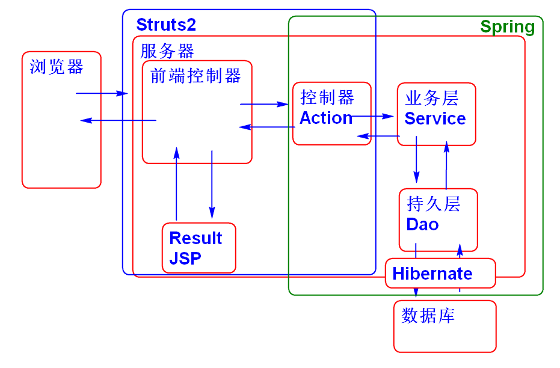

# SSH

## Hibernate

### 自增类型ID生成器

Hibernate 支持自增类型ID生成器, Hibernate会自动返回生成的ID值:

1. 声明实体类:

		public class Product implements Serializable {
			private static final long serialVersionUID = -2153926759496398436L;
			
			private Integer id;
			private String name;
			private Double price;
			private Date createDate;
			
			public Product() {
			}
		
			
			public Product(Integer id, String name, Double price, Date createDate) {
				super();
				this.id = id;
				this.name = name;
				this.price = price;
				this.createDate = createDate;
			}
		
		
			public Integer getId() {
				return id;
			}
		
			public void setId(Integer id) {
				this.id = id;
			}
		
			public String getName() {
				return name;
			}
		
			public void setName(String name) {
				this.name = name;
			}
		
			public Double getPrice() {
				return price;
			}
		
			public void setPrice(Double price) {
				this.price = price;
			}
		 
			public Date getCreateDate() {
				return createDate;
			}
		
		
			public void setCreateDate(Date createDate) {
				this.createDate = createDate;
			}
		
		
			@Override
			public String toString() {
				return "Product [id=" + id + ", name=" + name + ", price=" + price + ", createDate=" + createDate + "]";
			}
		
		
			@Override
			public int hashCode() {
				final int prime = 31;
				int result = 1;
				result = prime * result + ((id == null) ? 0 : id.hashCode());
				return result;
			}
		
			@Override
			public boolean equals(Object obj) {
				if (this == obj)
					return true;
				if (obj == null)
					return false;
				if (getClass() != obj.getClass())
					return false;
				Product other = (Product) obj;
				if (id == null) {
					if (other.id != null)
						return false;
				} else if (!id.equals(other.id))
					return false;
				return true;
			}
		}

2. 添加映射文件 Product.hbm.xml

		<?xml version="1.0" encoding="UTF-8"?>
		<!DOCTYPE hibernate-mapping PUBLIC 
		    "-//Hibernate/Hibernate Mapping DTD 3.0//EN"
		    "http://www.hibernate.org/dtd/hibernate-mapping-3.0.dtd">
		<!-- 映射文件: 将类映射到表, 将类中的属性映射到表的列 -->
		<hibernate-mapping>
			<class name="ssh.day04.Product" table="t_product">
				<id name="id" column="t_id">
					<generator class="identity"></generator>
				</id>
				<property name="name" column="t_name"/>
				<property name="price" column="t_price"></property>
				<property name="createDate"
				 column="t_create_date"/>
			</class>
		</hibernate-mapping>

	>identity 生成规则实际是由 org.hibernate.id.IdentityGenerator 来完成处理的.

3. 更新 hibernate.cfg.xml

		<!-- Drop and re-create the database schema on startup -->
		<property name="hbm2ddl.auto">update</property>
		<mapping resource="mapping/User.hbm.xml" />
		<mapping resource="mapping/Product.hbm.xml" />
	
	> 其中hbm2ddl.auto 属性可以在数据库中自动生成对表.

4. 测试:

		@Test
		public void testAddProduct(){
			Product p = new Product(null, "汽车", 
					2300.0, new Date());
			Session session = factory.openSession();
			Transaction tx = session.beginTransaction();
			System.out.println(p);
			session.save(p);
			//Hibernate 或自动读取自增的ID
			System.out.println(p);
			tx.commit();
			session.close();
		}

## 整合 Spring-Hibernate

1. 导入 Spring-orm 包

		<!-- 导入 Spring 整合 Hibernate 的插件 -->
		<dependency>
			<groupId>org.springframework</groupId>
			<artifactId>spring-orm</artifactId>
			<version>4.1.6.RELEASE</version>
		</dependency>
	
2. 导入 连接池

		<!-- 导入数据库连接池 -->
		<!--添加alibaba的druid连接池依赖 -->
		<dependency>
			<groupId>com.alibaba</groupId>
			<artifactId>druid</artifactId>
			<version>1.0.23</version>
		</dependency>

3. 配置 连接池和数据库连接参数
	- 数据库连接参数 config.properties

			driver=com.mysql.jdbc.Driver
			url=jdbc:mysql://localhost:3306/ssh
			username=root
			password=root
			initialSize=5
			maxActive=50
			minIdle=0
			maxWait=60000
			druid.filters=
			timeBetweenLogStatsMillis=60000

	- 数据源配置 spring-orm.xml

			<util:properties id="cfg" location="classpath:config.properties" />
			<!--配置DruidDataSource连接池 -->
			<bean id="dataSource" class="com.alibaba.druid.pool.DruidDataSource"
				destroy-method="close" init-method="init" lazy-init="true">
				<property name="driverClassName" value="#{cfg.driver}" />
				<property name="url" value="#{cfg.url}" />
				<property name="username" value="#{cfg.username}" />
				<property name="password" value="#{cfg.password}" />
				<!-- 初始化连接大小 -->
				<property name="initialSize" value="#{cfg.initialSize}" />
				<!-- 连接池最大数量 -->
				<property name="maxActive" value="#{cfg.maxActive}" />
				<!-- 连接池最小空闲 -->
				<property name="minIdle" value="#{cfg.minIdle}" />
				<!-- 获取连接最大等待时间 -->
				<property name="maxWait" value="#{cfg.maxWait}" />
			</bean>
	
4. 配置 Session Factory, spring-orm.xml

		<!-- 配置 hibernate Session Factory -->
		<bean id="sessionFactory"  class="org.springframework.orm.hibernate4.LocalSessionFactoryBean">
			<property name="dataSource" ref="dataSource"/>
			<property name="hibernateProperties">
				<props>
					<prop key="hibernate.dialect">
						org.hibernate.dialect.MySQL5Dialect
					</prop>
					<prop key="hibernate.show_sql">
						true
					</prop>
					<prop key="hibernate.format_sql">
						true
					</prop>
					<prop key="hibernate.hbm2ddl.auto">
						update
					</prop>
				</props>
			</property>
			<property name="mappingLocations" value="classpath:mapping/*.hbm.xml"/> 
		</bean>	

	> LocalSessionFactoryBean, 由 Spring-orm 提供的专门管理Hibernate Session Factory 的工具Bean

5. 测试

		public class OrmTestCase {
			ClassPathXmlApplicationContext ctx;
			SessionFactory factory;
			@Before 
			public void init(){
				ctx = new ClassPathXmlApplicationContext(
						"spring-orm.xml");
				factory = ctx.getBean("sessionFactory",
						SessionFactory.class);
			}
			@After
			public void destory(){
				factory.close();
				ctx.close();
			}
			
			@Test
			public void testGetProduct(){
				Session session=factory.openSession();
				Product p = (Product)
						session.get(Product.class, 1);
				System.out.println(p); 
				session.close();
			}
		}

### Hibernate Template 

Spring ORM 提供了 Hibernate Template 封装了 Session的功能, 并且比Seseion 更加方便. HibernateTempalte 也提供了 CRUD 功能. HibernateTempalte 是面向Dao而设计, 一般用于DAO的实现类.

利用Hibernate Tempalte 实现DAO:

1. 配置 Hibernate Template Bean, spring-orm.xml

		<!-- 配置hibernate Template -->
		<bean id="hibrenateTemplate" class="org.springframework.orm.hibernate4.HibernateTemplate">
			<property name="sessionFactory" ref="sessionFactory"/>
		</bean>
		<!-- 配置事务管理器 -->
		<bean id="txManager" class="org.springframework.orm.hibernate4.HibernateTransactionManager">
			<property name="sessionFactory" ref="sessionFactory"/>
		</bean>
		<!-- 配置声明式事务 -->
		<tx:annotation-driven transaction-manager="txManager"/>
	
	> 配置声明式事务管理, 用于支持@Transactional注解
	
2. 声明Dao接口

		public interface ProductDao {
			void add(Product p);
		}

3. 实现Dao接口

		@Repository("productDao")
		@Transactional
		public class ProductDaoImpl implements ProductDao{
			
			@Resource
			private HibernateTemplate hibernateTemplate;
			
			public void add(Product p) {
				hibernateTemplate.save(p);
			}
		} 

4. 测试:

		public class ProductDaoTest {
			ClassPathXmlApplicationContext ctx;
			ProductDao dao;
			
			@Before
			public void init(){
				ctx = new ClassPathXmlApplicationContext(
						"spring-orm.xml"); 
				dao=ctx.getBean(
						"productDao", ProductDao.class);
			}
			@After
			public void destory(){
				ctx.close();
			}
			
			@Test
			public void testAddProduct(){
				Product p=new Product(null, 
						"鼠标", 12.0, new Date());
				dao.add(p); 
			}
		}
		

### SSH 整合案例

架构:

步骤

1. 添加持久层接口方法 ProductDao

		List<Product> findAll();

2. 实现持久层 ProductDaoImpl

		public List<Product> findAll() {
			//sql: select * from t_product
			//hql: from Product
			String hql = "from Product";
			List<Product> list= (List<Product>)
					hibernateTemplate.find(hql);
			return list;
		}
3. 测试:

		@Test
		public void testFindAll(){
			List<Product> list=dao.findAll();
			for (Product product : list) {
				System.out.println(product); 
			}
		}

4. 添加业务层接口 
		
		public interface ProductService {
			
			List<Product> list();
			
		}

5. 实现业务层接口

		@Service("productService")
		@Transactional
		public class ProductServiceImpl 
			implements ProductService{
		
			@Resource
			private ProductDao productDao; 
			
			public List<Product> list() {
				return productDao.findAll();
			}
		}

6. 添加控制器 

		@Controller
		@Scope("prototype")
		public class ProductAction {
			
			@Resource 
			private ProductService productService;
			
			private List<Product> products;
			public List<Product> getProducts() {
				return products;
			}
			public void setProducts(List<Product> products) {
				this.products = products;
			}
			
			public String list(){
				products = productService.list();
				return "success";
			}
		}

7. 添加 JSP 作为视图: products.jsp

		<%@page pageEncoding="utf-8" 
		contentType="text/html; charset=utf-8" %>
		<%@taglib prefix="c" 
			uri="http://java.sun.com/jsp/jstl/core" %>
		<html>
			<head></head>
			<body>
				<!-- /WEB-INF/jsp/products.jsp -->
				<h1>产品列表</h1>
				<table>
					<tr>
						<th>编号</th>
						<th>名称</th>
						<th>价格</th>
					</tr>
					<c:forEach items="${products}" var="p">
						<tr>
							<td>${p.id}</td>
							<td>${p.name}</td>
							<td>${p.price}</td>
						</tr>
					</c:forEach>
				</table>
			</body>
		</html>

8. 配置 struts.xml 

		<package name="day04" namespace="/day04"
			extends="json-default">
			<!-- SSH 整合案例 -->
			<action name="list" class="productAction"
				method="list">
				<result name="success">
					/WEB-INF/jsp/products.jsp
				</result>
			</action>
		</package>

9. 测试:

		http://localhost:8088/ssh/day04/list.do

-------------------

## 作业

1. 创建项目搭建SSH环境
2. 实现商品的 CRUD 功能

